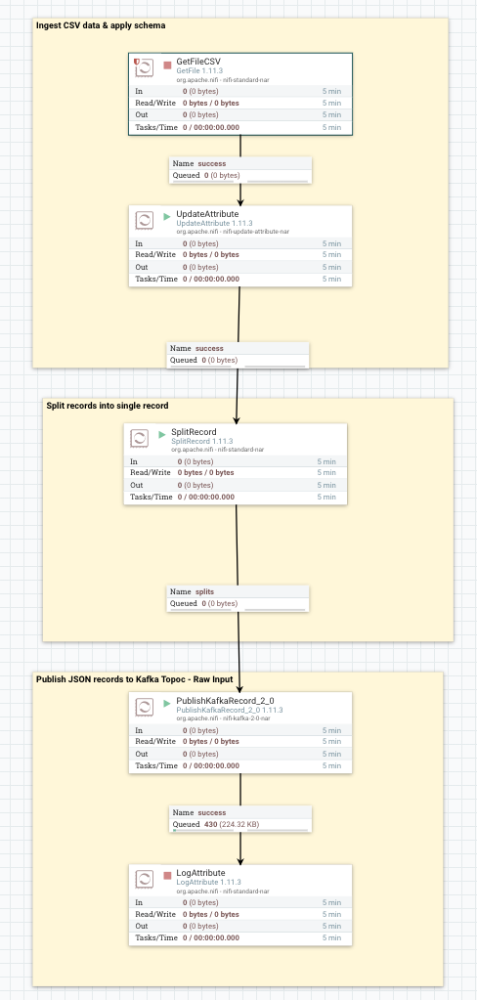
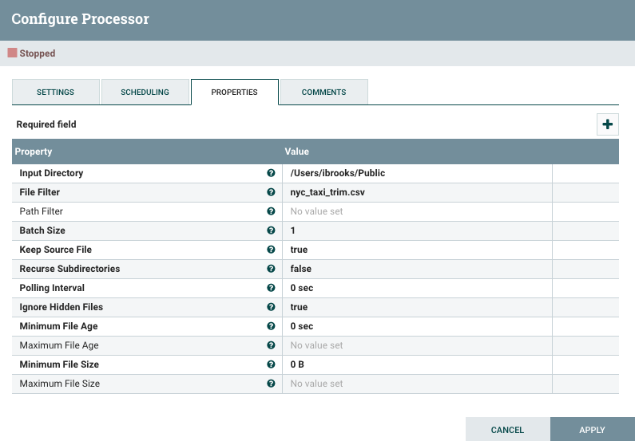
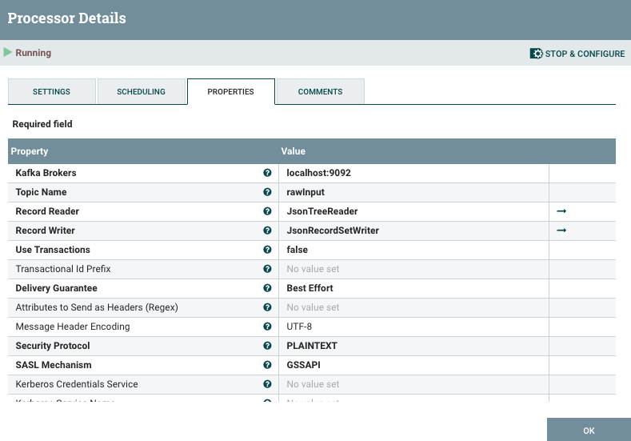
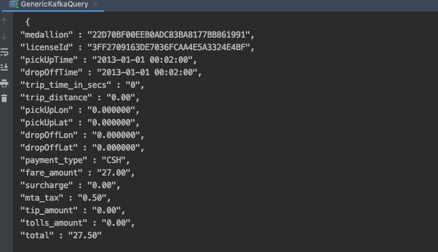
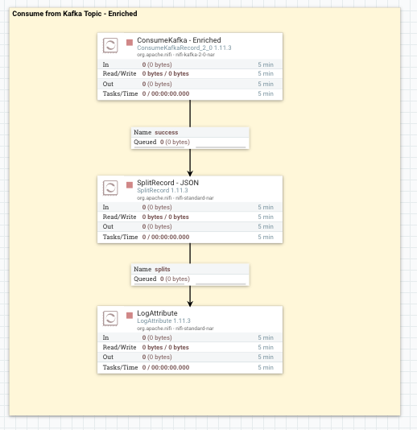
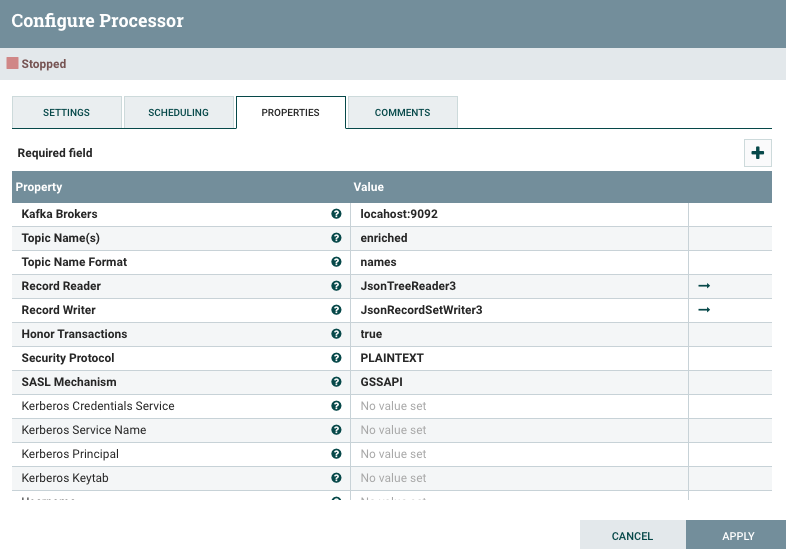

# There And Back Again, a Story of Apache Kafka & Apache Flink. 

 

#Project Details
This project has heavily inspired by two existing efforts from Data In Motion's FLaNK Stack and Data Artisan's blog on
stateful streaming applications.  The goal of this project is to provide insight into connecting an Apache Flink
applications to Apache Kafka. 

**FLaNK Stack**
* [FLaNK](https://www.datainmotion.dev/2019/11/introducing-mm-flank-apache-flink-stack.html)
* [FLaNK Home Site](https://www.flankstack.dev/)

**Data Artisan's**
* [Stateful Stream Processing Blog](https://www.infoworld.com/article/3267966/stateful-stream-processing-with-apache-flink.html)

**NYC Taxi Ride Data Set**
* [Taxi Ride Data Set](https://drive.google.com/file/d/0B0TBL8JNn3JgTGNJTEJaQmFMbk0)
* [Dataset Description](http://www.debs2015.org/call-grand-challenge.html)

##Project Scope
This project includes the Apache Flink application code and NiFi flow required to get the data into and out Apache Kafka.
It doesn't include installation steps NiFi, Kafka, or Flink, but links to installation documentations have been provided below.  

##Project Prerequisites
1. Apache NiFi local server
2. Apache Kafka with an empty topic called "rawinput" and "enriched"
3. IntelliJ IDE installed with Scala plug-in installed
4. A cloned copy of this Git repository 

## Project Set Up and Run

### Apache NiFi to Apache Kafka Setup
With Apache NiFi, the records from the source CSV file will be converted into individual JSON records.  These records
will be written to an Apache Kafka topic called "rawInput".  

 * In the NiFi UI, import the NiFi Flow template (XML file in this Git repo). For help, please review the following documentation.
 [Cloudera Documemnetation Link.](https://docs.cloudera.com/HDPDocuments/HDF3/HDF-3.4.1.1/getting-started-with-apache-nifi/content/working-with-templates.html)
 
 * Once the NiFi template is loaded, the left side of the NiFi flow will look like this. 
 
 
 
 * Right click on the GetFileCSV processor, open Properties tab, and set the path to the source CSV file in the Input Directory option.
 Please note, the CSV file is located in the data directory of this Git repo. 
 
 
 
 * Right click on the PublishKafkaRecord processor, open Properties tab, and verify the location of your Kafka broker and topic name. 
 
 
 
 * Verify the JSON records are being written to rawInput Kafka topic.  This can be accomplished with right side the NiFi flow.
 Once this has been verified please turn off Kafka Consumer processor.   
 
 
 

### Flink Application Development In IntelliJ
For Development purposes, a running Flink cluster isn't required for application development.  This application was
built inside of the IntelliJ IDE because it will stand up Flink when your application is running, and the shut it down.
This of course isn't required, but it will does make your life easier.

### Flink Application - Connect to Kafka Topic

Once JSON files are being written to the Kafka topic, Flink can create a connection to the topic and create a Flink table on top of it, 
which can later be queried with SQL.  This Github repository contains a Flink application that demonstrates this capability. 

#### Java Libraries Required
```java
import org.apache.flink.api.common.functions.FilterFunction;
import org.apache.flink.api.common.serialization.SimpleStringSchema;
import org.apache.flink.shaded.jackson2.com.fasterxml.jackson.databind.node.ObjectNode;
import org.apache.flink.streaming.api.TimeCharacteristic;
import org.apache.flink.streaming.api.datastream.DataStream;
import org.apache.flink.streaming.api.environment.StreamExecutionEnvironment;
import org.apache.flink.streaming.api.windowing.assigners.TumblingEventTimeWindows;
import org.apache.flink.streaming.api.windowing.time.Time;
import org.apache.flink.streaming.connectors.kafka.FlinkKafkaConsumer;
import org.apache.flink.table.api.DataTypes;
import org.apache.flink.table.api.EnvironmentSettings;
import org.apache.flink.table.api.Table;
import org.apache.flink.table.api.java.StreamTableEnvironment;
import org.apache.flink.table.descriptors.Json;
import org.apache.flink.table.descriptors.Kafka;
import org.apache.flink.table.descriptors.Schema;
import org.apache.flink.types.Row;
```


#### Define Flink Streaming Environment
* In Flink, the following java code defines the Flink Stream Execution and Stream Table Environments

```java
 //Class Member Static Variables
    static StreamExecutionEnvironment fsEnv;
    static StreamTableEnvironment fsTableEnv;
    static EnvironmentSettings fsSettings;

 // create execution environment
    fsSettings = EnvironmentSettings.newInstance()
       .useBlinkPlanner()
       .inStreamingMode()
       .withBuiltInCatalogName("default_catalog")
       .withBuiltInDatabaseName("default_database")
       .build();

    fsEnv = StreamExecutionEnvironment.getExecutionEnvironment();
    
  // configure event-time and watermarks
    fsEnv.setStreamTimeCharacteristic(TimeCharacteristic.EventTime);
    fsEnv.getConfig().enableForceAvro();
    fsEnv.getConfig().setAutoWatermarkInterval(1000L);

  //Create Streaming Table Environment
     fsTableEnv  = StreamTableEnvironment.create(fsEnv, fsSettings);
```
 
 #### Establish Flink Table Connection
 * In Flink, the following java code establishes a Flink Table connection with a Kafka topic.  Please note, the schema has been set as JSON and the schema has been provided.
 
 ```java
// create table environment
        fsTableEnv.connect(
                new Kafka()
                        .version("universal")
                        .topic("rawInput")
                        .startFromLatest()
                        .property("zookeeper.connect", "localhost:2181")
                        .property("bootstrap.servers", "localhost:9092")
                        .property("group.id", "test")
        )
        // declare a format for this system
        .withFormat(
           new Json()
        )
        // declare the schema of the table
        .withSchema(
           new Schema()
                .field("medallion", DataTypes.STRING())
                .field("licenseId", DataTypes.STRING())
                .field("pickUpTime", DataTypes.STRING())
                .field("dropOffTime", DataTypes.STRING())
                .field("trip_time_in_secs", DataTypes.BIGINT())
                .field("trip_distance", DataTypes.FLOAT())
                .field("pickUpLon", DataTypes.FLOAT())
                .field("pickUpLat", DataTypes.FLOAT())
                .field("dropOffLon", DataTypes.FLOAT())
                .field("dropOffLat", DataTypes.FLOAT())
                .field("payment_type", DataTypes.STRING())
                .field("fare_amount", DataTypes.FLOAT())
                .field("surcharge", DataTypes.FLOAT())
                .field("mta_tax", DataTypes.FLOAT())
                .field("tip_amount", DataTypes.FLOAT())
                .field("tolls_amount", DataTypes.FLOAT())
                .field("total", DataTypes.FLOAT())
        )
        .inAppendMode()
        // create a table with given name
        .createTemporaryTable("TaxiRides");
 ```
* The Flink application will display the following if everything is working as expected. 



#### Query Flink Table Built On Kafka Topic
* In Flink, the following Java code will query the newly established Flink Table and print to the screen 

```java
// define SQL query to compute average total per area and hour
    Table result = fsTableEnv.sqlQuery(
            "SELECT " +
                    " * " +
                    "FROM TaxiRides"
    );

    // convert result table into a stream and print it
    fsTableEnv.toAppendStream(result, Row.class).print();
```

#### Establish a Connection to Destination Kafka Topic 
* In Flink, the following java code will create a connection to a Kafka topic "enriched".  Please note, the schema has been set as JSON and the schema has been provided.

```java
 // create table environment
        fsTableEnv.connect(
            new Kafka()
            .version("universal")
            .topic("enriched")
            .startFromLatest()
            .property("zookeeper.connect", "localhost:2181")
            .property("bootstrap.servers", "localhost:9092")
            .property("group.id", "test")
        )
        // declare a format for this system
        .withFormat(
            new Json()
        )
        // declare the schema of the table
        .withSchema(
            new Schema()
                .field("medallion", DataTypes.STRING())
                .field("TimeStamp", DataTypes.TIMESTAMP(3) )
        )
        .inAppendMode()
        // create a table with given name
        .createTemporaryTable("KafkaSink");
```

#### Write to Kafka Topic From Flink Query
* In Flink, the following code will write the query results to a Kafka topic that was established in the previous step.

```java
// define SQL query to compute average total per area and hour
        Table result = fsTableEnv.sqlQuery(
                "SELECT " +
                " medallion, CURRENT_TIMESTAMP, " +
                " FROM  TaxiRides"
        );

        result.insertInto("KafkaSink");
```

* The following output is expected in the application.  Pleas note the last value in this images was removed from the code example. 


### Apache Kafka to NiFi
#### Read from Kafka Topic "enriched"
* In the NiFi UI, find the following section of the flow.



* Validate the Kafka settings are correct.



* Active the Consumer Kafka Processor and validate results. 


# Helpful Installation Links
## Apache NiFi
* [Installing NiFi on a MacBook](https://daviseford.com/blog/2017/12/18/installing-nifi.html)
* [Apache NiFi on Docker](https://github.com/apache/nifi/tree/master/nifi-docker)

## Apache Kafka
* [Apache Kafka Installation on Mac using Homebrew](https://medium.com/@Ankitthakur/apache-kafka-installation-on-mac-using-homebrew-a367cdefd273)
* [Apache Kafka on Docker](https://github.com/wurstmeister/kafka-docker)

## Apache Flink
* [Install Apache Flink on OSX](https://streambench.wordpress.com/2017/10/26/setting-up-apache-flink-on-mac-os-x/)
* [Video - Install Flink](https://www.youtube.com/watch?v=J8P1l0qlLRU)

## IntelliJ
* [Adding Packages to IntelliJ](https://blog.jetbrains.com/scala/2010/09/02/project-configuration-explained/)


# Additional Helpful Links
**Apache Flink**
* [Apache Flink Basic Transformation Example](https://dzone.com/articles/apache-flink-basic-transformation-example)
* [The Flink Table And SQL API](https://eventador.io/blog/the-flink-table-and-sql-api/)
* [Flink State Checkpointing](https://hackernoon.com/developers-the-api-to-bootstrap-your-flink-jobs-has-arrived-0h2c3zt9)
* [Apache Flink Table API & SQL](https://ci.apache.org/projects/flink/flink-docs-release-1.10/dev/table/)

**Apache Kafka + Apache Flink**
* [From Streams to Tables and Back Again: An Update on Flink's Table & SQL API](https://flink.apache.org/news/2017/03/29/table-sql-api-update.html)
* [Building Stateful Streaming Applications with Apache Flink](https://github.com/dataArtisans/infoworld-post)
* [How to build stateful streaming applications with Apache Flink](https://www.infoworld.com/article/3293426/how-to-build-stateful-streaming-applications-with-apache-flink.html)
* [Flink and Kakfa Pipelines](https://www.baeldung.com/kafka-flink-data-pipeline)
* [Consuming Kafka Messages From Apache Flink](https://dzone.com/articles/consuming-kafka-messages-from-apache-flink)
* [Kafka + Flink: A Practical, How-To Guide](https://www.ververica.com/blog/kafka-flink-a-practical-how-to)
* [Basic Apache Flink Tutorial: DataStream API Programming](https://www.alibabacloud.com/blog/basic-apache-flink-tutorial-datastream-api-programming_595685)
* [Introducing Flink Streaming](https://flink.apache.org/news/2015/02/09/streaming-example.html)
* [DataStream API - Writing to and reading from Kafka](https://training.ververica.com/exercises/toFromKafka.html)

**Apache Flink and Apache Kafka Code Examples** 
* [Using Flink to Consume and Produce from Kakfa topic](https://github.com/tspannhw/MmFLaNK/blob/master/IoTKafka.java)
* [Intro to Flink and Kakfa](http://tugdualgrall.blogspot.com/2016/10/getting-started-with-apache-flink-and.html)
* [Flink Table API](https://ci.apache.org/projects/flink/flink-docs-release-1.10/getting-started/walkthroughs/table_api.html)
* [Flink + Kafka + JSON Example](https://stackoverflow.com/questions/39300183/flink-kafka-json-java-example)
* [Read From Kakfa Code Example](https://github.com/dataArtisans/kafka-example/blob/master/src/main/java/com/dataartisans/ReadFromKafka.java)
* [Kafka Topic Name Dynamically In Flink](https://stackoverflow.com/questions/57266072/how-to-get-the-processing-kafka-topic-name-dynamically-in-flink-kafka-consumer)
* [Java Code Examples for org.apache.flink.streaming.connectors.kafka.partitioner.FlinkKafkaPartition](https://www.programcreek.com/java-api-examples/?api=org.apache.flink.streaming.connectors.kafka.partitioner.FlinkKafkaPartitioner)
* [Java Code Examples for org.apache.flink.streaming.connectors.kafka.FlinkKafkaConsumer09](https://www.programcreek.com/java-api-examples/?api=org.apache.flink.streaming.connectors.kafka.FlinkKafkaConsumer09)
* [Java Code Examples for org.apache.flink.table.api.TableEnvironment](https://www.programcreek.com/java-api-examples/?api=org.apache.flink.table.api.TableEnvironment)
* [Java Code Examples for org.apache.flink.table.api.java.StreamTableEnvironment.registerTableSource](https://www.programcreek.com/java-api-examples/?class=org.apache.flink.table.api.java.StreamTableEnvironment&method=registerTableSource)
* [Java Code Examples for org.apache.flink.table.api.TableSchema](https://www.programcreek.com/java-api-examples/?api=org.apache.flink.table.api.TableSchema)

**Apache Kafka + Apache Druid**
* [Apache Kafka ingestion](https://druid.apache.org/docs/latest/development/extensions-core/kafka-ingestion.html)
* [Tutorial: Load streaming data from Apache Kafka](https://druid.apache.org/docs/latest/tutorials/tutorial-kafka.html)

**Additional Apache Project Install Links**
* [Install Apache Druid](https://druid.apache.org/docs/latest/tutorials/index.html)
* [Install Apache Supersets](https://superset.incubator.apache.org/installation.html)
* [Build Apache Supersets from Source](https://medium.com/@kharekartik/a-better-guide-to-building-apache-superset-from-source-2c8dbad38b2b)

**Additional Apache Projects On Docker**
* [Druid on Docker](https://github.com/anskarl/druid-docker-cluster)
* [Apache Druid on Docker](https://github.com/anskarl/druid-docker-cluster)